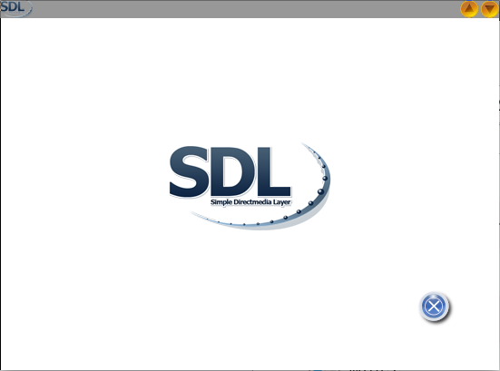

SDL2 - Custom Titlebar

This is a small SDL2 Demo and it does demonstrate how...  

  * to roll your own Window Deco

Useful links:  
[SDL2](https://www.libsdl.org/) [SDL-Discourse](https://discourse.libsdl.org) [Example Code](https://gist.github.com/Acry/baa861b8e370c6eddbb18519c487d9d8)

Screenshot:  

Assets  
in source folder - opencliparts  

[Get in touch on SDL-Discourse](https://discourse.libsdl.org/u/Acry/summary)
